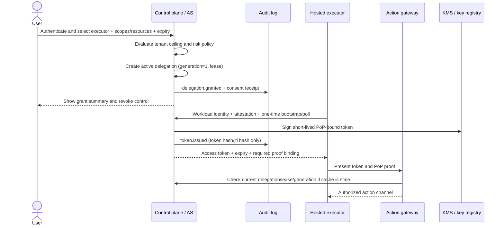

# Revocable Authority Model for a Hosted Persistent Executor

Status: proposed design
Scope: hosted persistent executors that perform actions for a user's account
Decision type: security and authorization architecture

## 1. Summary

A hosted executor must never receive an unbounded, long-lived copy of the user's
credentials. Instead, the control plane records an explicit user-to-executor
delegation and issues the executor short-lived, proof-of-possession access
tokens. The executor uses those tokens through an authorization gateway; a
credential broker holds provider refresh tokens and performs token exchange or
the downstream call on the executor's behalf.

The delegation record is the source of truth. A token is valid only while all
of the following are true:

1. the user delegation is active;
2. the executor workload identity and proof-of-possession key match the grant;
3. the lease and token have not expired;
4. the requested operation and normalized resource are in the grant's policy;
5. the delegation generation and policy version in the token are current; and
6. the token, delegation, principal, and signing-key version are not revoked.

A user-facing revoke operation changes the source of truth first, increments a
generation fence, publishes a durable revocation event, and stops new actions
locally without waiting for an external provider's revocation endpoint. Cached
verifiers receive the event and have a bounded freshness window. State-changing
requests fail closed if revocation state cannot be checked. Provider
revocation, executor shutdown, and cleanup are asynchronous follow-up actions.

The model deliberately distinguishes **blocking future authority** from
**undoing an external action that has already committed**. The latter is only
best effort and is reported as such.

## 2. Goals, non-goals, and security invariants

### Goals

- Give a user a visible, auditable delegation to a particular hosted executor.
- Constrain the executor by operations, resources, time, rate, and risk level.
- Make ordinary user revocation effective without rotating every user's secret.
- Bound the usefulness of a stolen token and prevent bearer-token replay where
  the client supports proof of possession.
- Keep provider refresh tokens and other durable credentials outside the
  executor process and outside the model/tool context.
- Preserve enough audit detail to answer who granted, used, and revoked access,
  without recording credentials or sensitive payloads.
- Fail closed for new side effects during authorization uncertainty.

### Non-goals

- Guaranteeing that a third-party provider can undo a request that already
  committed before revocation.
- Treating KMS key rotation alone as an immediate per-user revocation system.
- Allowing a model, job payload, or arbitrary executor code to choose the user
  principal or broaden its own grant.
- Replacing the third-party provider's own consent, scopes, or revocation
  rules.

### Non-negotiable invariants

1. **No ambient authority.** The executor gets only an explicitly issued
   delegation. Environment-wide cloud credentials and user refresh tokens are
   not implicitly available to it.
2. **The caller cannot select the subject.** `sub` is derived by the
   authorization service from the delegation; a request field cannot change it.
3. **No transitive delegation by default.** An executor may act, but may not
   mint a grant for another executor. Any future delegation chain has a fixed
   maximum depth and must preserve the original policy ceiling.
4. **Every action is attributable.** The authorization decision is tied to the
   user, tenant, executor service, executor instance, delegation, token ID, and
   request/action ID.
5. **Revocation is local-first.** Once the control plane acknowledges a revoke,
   it will not authorize a new action for that delegation, even if the provider
   revocation call is unavailable.
6. **Uncertainty is not permission.** A write, delete, send, trade, or other
   side effect is denied when the gateway cannot obtain sufficiently fresh
   revocation/policy state.
7. **Tokens are disposable.** Access tokens are short-lived and cannot be
   refreshed by presenting the token itself. Renewal requires the executor
   workload identity, a live lease, and a current delegation.
8. **Cryptography is not the policy source of truth.** Signature validation
   proves issuance, not current authorization. Current delegation state and
   generation must still be checked.

## 3. Actors and trust boundaries

| Actor | Identity | Responsibility / trust boundary |
| --- | --- | --- |
| User principal | Stable `principal_id` from the account identity provider | Owns the account and gives or revokes consent. A user login is not automatically executor authority. |
| Tenant / resource owner | `tenant_id` and provider account IDs | Adds organization policy ceilings and may perform separately audited administrative revocation. |
| Hosted executor service | Platform-issued workload identity, preferably OIDC/SPIFFE/mTLS | Runs persistent jobs and requests narrowly scoped tokens. It is not trusted with unrestricted user credentials. |
| Executor instance / job | Attested instance key and `instance_id`; optional `job_id` | Provides proof of possession and is bound to the grant's allowed execution context. |
| Authorization service (AS) | Service identity plus KMS-backed signing keys | Creates delegations, exchanges workload proofs for tokens, evaluates current grants, and records revocation state. |
| Authorization gateway | Service identity, trusted JWKS, revocation/policy cache | Enforces the token, proof, scope, resource, lease, generation, and freshness checks immediately before an action. |
| Credential broker | Isolated service with vault/KMS access | Stores provider refresh tokens, exchanges them for short-lived provider tokens, or makes the provider request itself. |
| Hosted provider / external API | Provider-specific account and scopes | Receives only the narrow credential or brokered request it needs. It remains an independent trust boundary. |
| Audit log | Append-only, access-controlled sink | Records grants, use, decisions, revokes, and cleanup without raw secrets. |

The model or agent running inside the executor is not a separate authority
principal. It can request an action through the executor's action interface;
the executor enforces the same delegation and policy checks and keeps the
access token out of prompts, tool output, job logs, and arbitrary task files.

## 4. Authority objects and state

### 4.1 Principal and delegation

A delegation is a first-class object, not an informal relationship encoded only
in a token. Its durable record contains at least:

- `delegation_id`: high-entropy, non-meaningful identifier;
- `principal_id`: the user on whose behalf actions may occur;
- `tenant_id`: tenant/resource-owner boundary, when applicable;
- `executor_service_id`: the approved hosted executor service;
- `executor_instance_policy`: whether one attested instance, a service pool,
  or an approved deployment identity may use the grant;
- `bound_key_id` or accepted attestation policy for proof of possession;
- `scopes`: normalized operation permissions;
- `resources`: normalized resource/account/host allowlists;
- `constraints`: time windows, rate/budget limits, data-class limits, and
  confirmation requirements;
- `policy_version` and `policy_hash`;
- `generation`: monotonically increasing revocation/policy fence;
- `status`: `pending`, `active`, `suspended`, `expired`, or `revoked`;
- `lease_expires_at` and optional `grant_expires_at`;
- `created_at`, `created_by`, `consent_id`, and consent evidence reference;
- `revoked_at`, `revoked_by`, and a normalized revoke reason, when revoked.

The source of truth applies an atomic state transition on revoke:

```text
status = revoked
revoked_at = now
revoked_by = authenticated actor
generation = generation + 1
```

Policy changes that reduce or replace authority also increment `generation`.
A token carrying an older generation is invalid even if its signature and
expiry are otherwise valid. A principal-level `revoke_all_before` fence can
apply the same rule to every delegation owned by a user.

### 4.2 Lease

A persistent executor does not receive an indefinitely valid session. It holds
a rolling lease associated with the delegation. The executor renews the lease
using its workload identity and proof key; it cannot renew after the delegation
is revoked, suspended, or past its user-selected grant expiry.

Recommended starting defaults, subject to product risk review:

- access token lifetime: 5 minutes; 1 minute for high-impact operations;
- lease TTL: 15 minutes, renewed before one-third of the TTL remains;
- executor inactivity: lease expires when heartbeats stop;
- grant expiry: explicit in user consent, with a product maximum; an
  "until revoked" grant still has the rolling lease and token limits;
- gateway cached authorization freshness: no more than 30 seconds for ordinary
  actions, and live/source-of-truth checking for high-impact actions.

These are bounds, not a license to permit an offline queue to continue acting.
A queued job must reauthorize at dispatch time.

### 4.3 Credential broker record

For a provider integration, the broker stores the provider's durable refresh
credential (or equivalent) in an encrypted vault. The executor receives one of:

- a short-lived provider access token constrained to the requested operation;
- a broker session handle that can perform only the delegated provider call; or
- a result from a brokered request, without seeing the provider secret.

The preferred path is a broker session or token exchange. If a provider only
supports a refresh token, that token remains in the broker. A provider token
issued to the executor is still subject to the local delegation, lease, and
revocation checks and is never treated as a bypass.

## 5. Credential and token format

### 5.1 Bootstrap and token exchange

The user consent flow creates the durable delegation. It does not put a
long-lived user secret in a URL, environment variable, prompt, or job payload.
The executor then authenticates with its platform workload identity and
exchanges a one-time bootstrap handle, or an approved delegation reference,
for a short-lived access token. The exchange requires a proof from the
executor's attested key.

The bootstrap handle is single-use, high entropy, audience-bound, and stored
hashed at rest. It expires quickly. If it is not needed because the executor
can prove its service identity and poll for approved grants, that polling path
is preferred: it reduces secret delivery during provisioning.

### 5.2 Access token

Use a signed, compact capability token for gateway transport. JWT is acceptable
for interoperability; use a modern asymmetric algorithm such as EdDSA or
ES256, with an AS-managed KMS signing key. The token contains opaque IDs and
policy references rather than human-readable personal data. It is not accepted
by a provider directly.

Illustrative claims (names are normative at the design level; exact encoding is
implementation-specific):

```text
header:
  typ: "hst-exec+jwt"
  alg: "EdDSA"              # or an approved asymmetric algorithm
  kid: "authz-signing:v18"

payload:
  iss: "https://auth.example/"
  sub: "principal:<opaque-user-id>"
  act:
    service: "hosted-executor"
    instance: "exec-instance:<opaque-id>"
    job: "job:<opaque-id>"  # present when policy binds a single job
  tenant: "tenant:<opaque-id>"
  delegation_id: "del_<opaque-id>"
  generation: 4
  policy_version: 12
  policy_hash: "sha256:<digest>"
  aud: "executor-action-gateway"
  scope: ["calendar.events.read", "calendar.events.create"]
  resources: ["provider:calendar/account:<opaque-id>"]
  cnf:
    jkt: "<thumbprint-of-executor-public-key>"
  jti: "<random-token-id>"
  iat: <issued-at>
  nbf: <not-before>
  exp: <short-expiry>
```

Requirements for the format:

- `sub`, `tenant`, `act`, `delegation_id`, and `generation` are minted by the
  AS, never copied from an executor request.
- `aud` is specific to the intended gateway. A token for one gateway or
  provider cannot be replayed at another audience.
- `scope` is an allowlist of operation names, not a free-form verb or URL.
- `resources` are canonical IDs or policy references. The gateway normalizes
  any requested URL, account, object, and host before matching it.
- `cnf.jkt` binds the token to the executor's public key. DPoP-style proofs or
  mTLS certificate binding should cover method, target, freshness, and replay.
- `jti` is random and unique. The raw token is never logged; use a keyed hash
  of `jti` or the token for correlation.
- `exp` is short. A token cannot be renewed merely by presenting an unexpired
  token.
- `policy_hash` makes policy drift visible and allows the gateway to reject a
  token created from an obsolete policy snapshot.

When JWT claim privacy or token-size limits are important, the same contract
may be represented as an opaque reference token. The introspection response
must expose the equivalent claims and current delegation generation. The
revocation semantics do not change.

### 5.3 Proof of possession and replay

Each request carries a DPoP-style proof or mTLS identity matching `cnf`. The
proof includes the HTTP method, normalized target, a unique proof ID, and a
bounded timestamp. Gateways maintain a short replay cache for proof IDs. A
stolen access token without the private key is therefore unusable from another
client; if both token and key are compromised, revoke the delegation and
quarantine the executor instance.

For non-idempotent actions, the executor also supplies an action-level
idempotency key. The gateway records whether the provider outcome is `success`,
`failure`, or `unknown`; a timeout after a possible commit is never blindly
retried.

### 5.4 KMS key versioning

Every token carries the signing `kid` and key version. KMS rotation has three
separate uses:

1. **Routine hygiene:** publish a new signing version and retain the previous
   version only for a controlled verification grace period.
2. **Emergency global or tenant fence:** mark a compromised key version
   revoked in the authorization state store, publish that event, and reject
   every token carrying that version even if its `exp` has not passed. Reissue
   tokens from the new version only after policy checks.
3. **Credential-vault protection:** encrypt provider credentials with
   per-tenant/per-delegation envelope keys (or KMS grants) and record the key
   generation. The broker checks the generation before decrypting. Disabling a
   wrapping key or grant can prevent future decryptions during an emergency.

Rotating a KMS key or alias by itself is **not** a revocation guarantee: old
signatures can remain verifiable and plaintext already cached in a process
cannot be recalled. Explicit revoked-key state, short token lifetimes, local
policy fences, and cache eviction are required. Per-user revocation remains a
delegation generation/status operation, not a global KMS operation.

## 6. Policy, scopes, and allowlists

Authorization is the intersection of four policies:

```text
requested action
  ∩ user-granted delegation
  ∩ tenant/platform safety ceiling
  ∩ provider capability
```

A request outside any one of these sets is denied. The executor cannot ask the
AS to elevate a grant; it must obtain new user consent.

### Scope design

Scopes should be small, named, and tied to a stable operation catalog. Examples:

- `calendar.events.read`
- `calendar.events.create`
- `calendar.events.update`
- `calendar.events.delete`
- `files.metadata.read`
- `files.content.write`

Separate read, write, delete, send, financial, administrative, and credential
operations. Avoid `*`, unrestricted shell/network scopes, and provider-wide
admin scopes. High-impact actions can require a fresh user confirmation even
when the base delegation contains the corresponding scope.

### Resource and execution constraints

The grant may additionally specify:

- exact provider account IDs, tenant IDs, project IDs, or object IDs;
- normalized HTTPS host allowlists and path templates, never arbitrary URLs;
- permitted executor service/deployment and attested instance class;
- allowed time window and maximum grant/lease duration;
- per-minute and per-day action quotas;
- spend/notional/size limits;
- data-class restrictions and egress destinations;
- whether human confirmation is needed at dispatch time;
- whether the job may create durable follow-on jobs or callbacks (default: no).

URL, account, and object matching must canonicalize scheme, host, port, path,
encoding, and identifiers before policy evaluation. Redirects must be
revalidated; credentials must not follow a redirect to a different host.

## 7. Lifecycle flows

### 7.1 Grant and bootstrap



Detailed grant rules:

1. The user authenticates with the account identity provider and, for a high
   risk grant, completes step-up authentication.
2. The UI displays executor identity, deployment/tenant, exact scopes,
   resources, duration, provider accounts, and whether actions require
   confirmation.
3. The AS validates the executor service and tenant policy before creating the
   delegation. Consent is recorded with a stable `consent_id`.
4. The AS creates the delegation and an outbox event in one transaction. The
   initial state is not usable until policy and credential-broker readiness
   checks pass.
5. The executor proves its workload identity and public key. A one-time
   bootstrap is consumed, or the executor polls for grants it is eligible to
   use. The AS issues a short-lived token.
6. The token is delivered only over the authenticated executor channel. It is
   held in memory or a protected secret store, never in job input or logs.

### 7.2 Token use and downstream credential exchange

```mermaid
sequenceDiagram
    participant E as Hosted executor
    participant GW as Action gateway
    participant AS as AuthZ state / introspection
    participant B as Credential broker
    participant P as External provider
    participant EV as Audit log

    E->>GW: Action + DPoP/mTLS proof + access token + idempotency key
    GW->>GW: Verify signature, audience, expiry, PoP, request shape
    GW->>AS: Validate delegation status, lease, generation, policy, revocation
    AS-->>GW: Active decision or deny
    GW->>EV: action.requested + authorized/denied decision
    GW->>B: Brokered operation / narrow provider token request
    B->>AS: Recheck delegation before sensitive provider use
    B->>P: Provider call with broker-held credential
    P-->>B: Provider result
    B-->>GW: Result / failure / unknown outcome
    GW->>EV: credential.exchanged + action.completed/failed/unknown
    GW-->>E: Sanitized result; never provider refresh token
```

The gateway performs the current-state check immediately before the side effect.
A cached positive decision is usable only within its freshness bound. For
high-impact operations, the check is live or uses a revocation stream with a
strictly bounded sequence/epoch. The broker performs a second check before
using a durable provider credential, which limits the blast radius of a gateway
bug or a queued request.

### 7.3 User-facing revoke

```mermaid
sequenceDiagram
    actor U as User
    participant UI as Account UI
    participant AS as Control plane / AS
    participant DB as Delegation + revocation store
    participant BUS as Durable revocation stream
    participant GW as Gateways / broker
    participant E as Executor
    participant P as External provider
    participant EV as Audit log

    U->>UI: Click Revoke on an active executor grant
    UI->>AS: Authenticated, idempotent revoke request
    AS->>DB: Atomic status=revoked, generation++, local fence
    AS->>EV: delegation.revoked
    AS->>BUS: Publish revocation event + generation
    BUS-->>GW: Invalidate delegation/token/policy caches
    BUS-->>E: Stop/interrupt signal (best effort)
    AS-->>UI: Local authority blocked; cleanup pending if needed
    GW-->>E: Deny all new actions for old generation
    AS->>P: Provider revoke/disconnect (async, if supported)
    AS->>EV: cleanup/provider revoke result
    UI-->>U: Revoked timestamp, last action, cleanup status
```

The revoke transaction is considered successful when local authorization is
blocked and the durable event is recorded. It does not wait for a provider
that is slow or unavailable. The UI separately reports provider cleanup and
whether an in-flight operation had an unknown outcome.

Revoke processing order:

1. Authenticate the user and enforce CSRF/re-authentication requirements.
2. Check that the delegation belongs to the user or that the actor has an
   explicit, audited tenant/admin role.
3. Atomically set the delegation to `revoked` and increment its generation.
4. Add the delegation ID (and any specific token IDs) to the durable
   revocation index. This index is the authoritative revocation list for
   delegation- and token-level deny decisions; update the user-level fence for
   "revoke all".
5. Write the outbox event and `delegation.revoked` audit event atomically.
6. Invalidate local caches and stop lease renewal. The executor must fail any
   new dispatch after receiving the signal, but the gateway remains the final
   enforcement point.
7. Evict broker sessions and cached provider access tokens; delete or disable
   delegation-specific secret references. Request provider revocation when
   supported, with bounded retries and no duplicate non-idempotent requests.
8. Reconcile in-flight actions. If the provider supports cancellation, use a
   separate idempotent cancel operation; otherwise mark the outcome honestly.

The revoke endpoint should be idempotent. Repeating it returns the existing
revocation timestamp and does not create a second semantic revoke, although a
second audit event may record the repeated request.

## 8. Revocation mechanisms and guarantees

| Mechanism | What it revokes | Latency / limit | Required use |
| --- | --- | --- | --- |
| Short-lived access token | A leaked token after its `exp` | Bounded by token TTL; cannot stop a token already in use by itself | Always use; 5 minutes is a reasonable initial default |
| Delegation status + generation fence | All tokens and leases for one grant | Immediate at source of truth; cache bounded by freshness/event SLO | Primary user and tenant revoke mechanism |
| Token/JTI revocation index | One token or a narrow compromised session | Immediate for gateways that consult the index; useful before token expiry | Use for suspected token theft or incident response |
| Lease TTL and heartbeat | Executor sessions that stop renewing or lose connectivity | At most lease TTL, and no new token after expiry | Always use for persistent executors |
| Principal-level fence | All executor grants for a user | Same source-of-truth/cache guarantees as delegation revoke | Account compromise, "revoke all", or identity-provider disable |
| KMS signing-key version fence | Every token signed by a compromised key version | As fast as key-revocation state propagates; broad blast radius | Emergency global/tenant kill switch, not ordinary revoke |
| Vault key/grant disablement | Future decryption of stored provider credentials | Depends on KMS policy propagation; plaintext already held cannot be recalled | Emergency containment and credential-vault defense in depth |
| Provider OAuth/API revoke | Provider's copy of a durable grant | Provider-specific and often asynchronous | Best-effort cleanup after local revoke; never the local gate |

### Cache and outage contract

- The durable revocation store and event stream are authoritative.
- Gateways maintain a cache with a monotonic revocation epoch/generation. They
  reject cached state older than the configured freshness bound.
- A gateway that has received a newer revoke event denies immediately; events
  are replayable and consumers periodically reconcile from the source of truth.
- If the source of truth, event stream, or KMS key status is unavailable,
  issuance and lease renewal stop. State-changing actions fail closed. A
  strictly read-only action may continue only with a fresh, non-revoked cached
  decision and a product-approved outage policy; it must not be used as a
  path to cause side effects.
- The gateway exposes a safe diagnostic such as `authorization_state_stale`,
  not raw database or provider errors or credentials.

The product should publish a revocation propagation SLO, for example: local
revoke is acknowledged after the durable fence is committed, and all gateways
must deny within the smaller of the cache freshness bound or the event-stream
SLO. Monitoring should alert when a consumer has not advanced its revocation
epoch.

## 9. Audit events

Audit is append-only and access-controlled. Events are correlated but do not
contain raw access tokens, refresh tokens, private keys, provider request
bodies, or unrestricted personal data.

### Event types

- `delegation.requested`
- `delegation.granted`
- `delegation.suspended`
- `delegation.renewed` / `lease.renewed`
- `token.issued`
- `token.rejected`
- `action.requested`
- `action.authorized`
- `action.denied`
- `credential.exchange.requested`
- `credential.exchange.denied`
- `provider.request.completed`
- `provider.request.failed`
- `provider.request.unknown`
- `token.revoked`
- `delegation.revoked`
- `principal.revoke_all`
- `executor.quarantined`
- `provider.revoke.requested`, `provider.revoke.succeeded`,
  `provider.revoke.failed`
- `kms.key_version.revoked`
- `revocation.consumer_lagged`

### Common event envelope

Each event includes, where applicable:

- `event_id` and `occurred_at` in UTC;
- `event_type` and schema version;
- `tenant_id`, `principal_id`, `executor_service_id`, `executor_instance_id`;
- `delegation_id`, `generation`, `policy_version`, and `policy_hash`;
- keyed hash of `jti` or token reference, never the token itself;
- `consent_id`, `action_id`, `request_id`, and distributed `trace_id`;
- normalized operation, resource reference, provider, and data/risk class;
- decision (`allow`, `deny`, `revoked`, `expired`, `unknown`) and reason code;
- KMS signing/wrapping key version when relevant;
- result status, latency, and sanitized error code;
- actor identity and authentication assurance for grant/revoke events.

Grant and revoke events must identify the human or administrative actor. Use
`requested_by` and `effective_subject` separately so an operator action cannot
be mistaken for user self-service. Store consent evidence by reference, with
strict retention and access controls. Hash-chain or sign audit batches and
replicate them to an append-only/WORM store if the threat model includes a
compromised control plane.

## 10. User-facing revoke experience

The account settings page should expose an **Active executor access** list with:

- friendly executor name plus verified service/deployment identity;
- tenant/project and provider account;
- scopes rendered as plain-language operations;
- constrained resources, limits, and whether confirmation is required;
- grant creation time, explicit expiry, lease/last heartbeat, and last use;
- current status (`active`, `suspended`, `revoking`, `revoked`, `expired`);
- recent action summary and a link to the audit view.

Actions:

1. **Revoke this executor grant** — stops new actions for one delegation.
2. **Revoke all executor access** — advances a principal-wide fence and affects
   every active delegation.
3. **Disconnect provider** — optional separate action that also requests the
   provider's token revocation/deauthorization.
4. **Report compromise** — revokes the grant, quarantines the executor
   instance, and can trigger a broader account fence and credential rotation.

The confirmation dialog should say: "New actions will be blocked immediately.
An action already accepted by the provider may not be undoable." After local
commit, show the revoke timestamp, the last accepted action, any in-flight
`unknown` actions, and provider cleanup status. Do not make a green provider
cleanup badge a prerequisite for showing local access as revoked.

Self-service revoke requires a normal authenticated session plus CSRF
protection; require recent reauthentication/WebAuthn for revoke-all or other
high-impact account actions. Tenant administrators and support operators use
separate roles, visible actor labels, and audited break-glass procedures.

There is no "un-revoke" operation. Re-enabling access requires a new consent
flow that creates a new delegation, generation, and proof key binding.

## 11. Compromise and failure scenarios

| Scenario | Expected behavior |
| --- | --- |
| Access token copied from executor logs or memory | PoP binding blocks replay without the key; short expiry limits exposure. Revoke the delegation/JTI, rotate the executor key, and inspect audit events. |
| Token and executor private key both stolen | Treat the executor instance as compromised. Revoke delegation, quarantine the instance, evict broker sessions, and rotate provider credentials as needed. |
| Executor process or model attempts a broader scope | Gateway derives subject and policy from the signed grant and denies the request. New scope requires new user consent. |
| Confused deputy or cross-tenant resource | Require audience, tenant, service, and canonical resource matches. Never forward credentials across redirects or unapproved hosts. Deny on mismatch. |
| Replay of a DPoP proof or duplicate write | Proof ID replay cache rejects duplicates; action idempotency key and provider reconciliation prevent blind duplicate retries. |
| Executor is offline after user revoke | Lease renewal fails; stale queued work is rechecked at dispatch and denied. Reconnect requires a fresh token exchange and current delegation. |
| Revocation event is delayed | Gateway checks source-of-truth generation when cache is stale; event consumers have monotonic epochs and reconciliation. Cache freshness provides a measurable upper bound. |
| Revocation database/event bus is unavailable | Do not issue or renew tokens. Deny state-changing requests. Allow only explicitly approved fresh read-only cache behavior. Alert on stale consumers. |
| KMS signer unavailable | No new tokens or renewals. Existing side-effect requests still need current policy/revocation checks; do not turn signature-cache availability into an authorization bypass. |
| Signing key version compromised | Mark the version revoked, publish the fence, reject all tokens with that `kid`, rotate to a new version, and reissue only after grant checks. Expect broad impact. |
| KMS key rotated but old version still accepted | This is not a successful revoke. Keep explicit key-version revocation metadata and test the verifier's rejection path. |
| Provider revocation endpoint fails | Local delegation remains revoked. Retry provider cleanup with bounded, idempotent operations and show `provider_cleanup_pending`; never continue using the provider credential. |
| Provider call times out after possible commit | Record `unknown`; reconcile by provider request/action ID. Do not blindly retry a non-idempotent operation. |
| Revocation races with a request | The gateway orders the policy check and action admission. If revoke commits before admission, deny; if the provider accepted before revoke, record the action as pre-revoke and do not claim it was undone. |
| User account or IdP is compromised/disabled | Consume identity-provider disable events, advance the principal fence, revoke all delegations, and require fresh high-assurance consent after recovery. |
| Audit sink is unavailable | Do not silently authorize high-impact actions without an audit path. Buffer only in a durable, bounded local queue with backpressure; never buffer secrets. |
| Provider credential exists in executor cache | Broker sessions have short TTL and delegation binding. On revoke, invalidate sessions and make the broker reject old generation; use process isolation and memory zeroization where feasible. |

## 12. Operational controls and verification criteria

Before launch, the following controls should be demonstrated in an integration
environment:

- A user can grant one executor a read scope and a separate write scope; the
  executor cannot use the other scope or another tenant/resource.
- A token for delegation generation `n` is rejected after the delegation is
  revoked or changed to generation `n+1`, even when the JWT has not expired.
- Revoke-all invalidates every user delegation without requiring provider calls
  to finish.
- A stolen token without its PoP key is rejected; a replayed proof ID is
  rejected; a token presented to the wrong audience is rejected.
- Lease expiration prevents renewal and action admission; an offline queued
  job cannot bypass the check.
- A revocation event invalidates gateway and broker caches, and a deliberately
  stale consumer is observable and eventually reconciled.
- Authorization and lease renewal fail closed for writes during revocation-store
  or KMS-status uncertainty.
- Provider refresh tokens never appear in executor memory/logs, model context,
  action results, audit events, or error bodies.
- Provider timeout, provider revoke failure, and in-flight revoke races produce
  `failed` or `unknown` audit outcomes rather than false success.
- Audit records can reconstruct grant -> token issuance -> action decision ->
  revoke -> cleanup using IDs and hashes, without exposing secret material.
- Key-version emergency fencing rejects old-key tokens and allows only new,
  policy-checked token issuance.

## 13. Recommended decision

Adopt a two-layer authority model:

1. **Durable delegation + generation/lease state** in the control plane is the
   authoritative user consent and revocation object.
2. **Short-lived, asymmetric, proof-of-possession capability tokens** are the
   transport credential for the action gateway, with a live or bounded-fresh
   revocation check on every side effect.
3. **Credential broker isolation** keeps provider refresh credentials out of the
   hosted executor and supplies only narrow, short-lived provider access.
4. **Revocation eventing plus an indexed revocation store** gives fast cache
   invalidation, while source-of-truth checks and fail-closed behavior protect
   against event loss or outages.
5. **KMS key-version fences** provide emergency broad containment and vault
   protection, but are explicitly treated as defense in depth rather than a
   substitute for per-delegation status and generation checks.

This balances a persistent executor's need to operate unattended with a clear
user control: an authenticated revoke changes the local authority boundary
immediately, is visible in the audit trail, and forces any future access to be
re-approved rather than silently restored.
